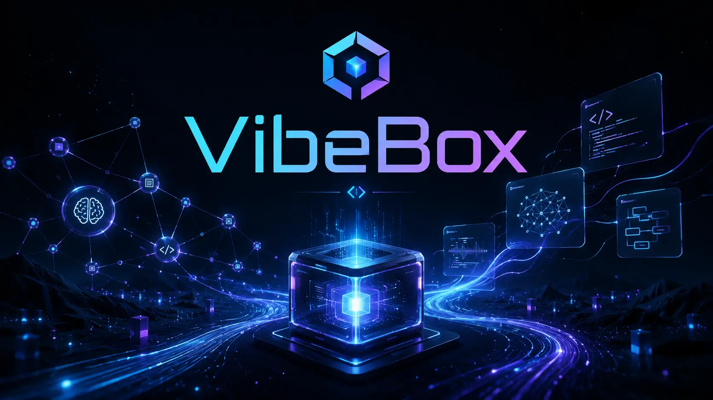
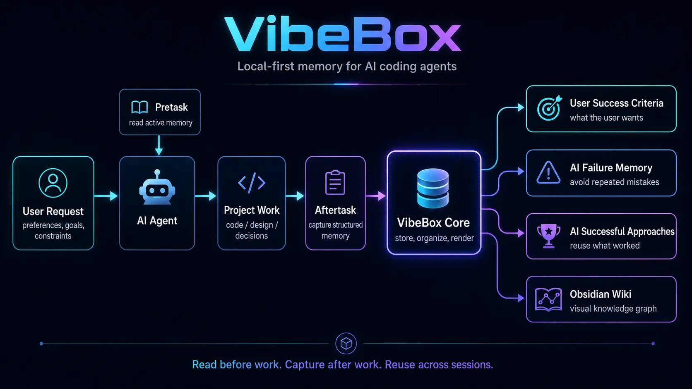
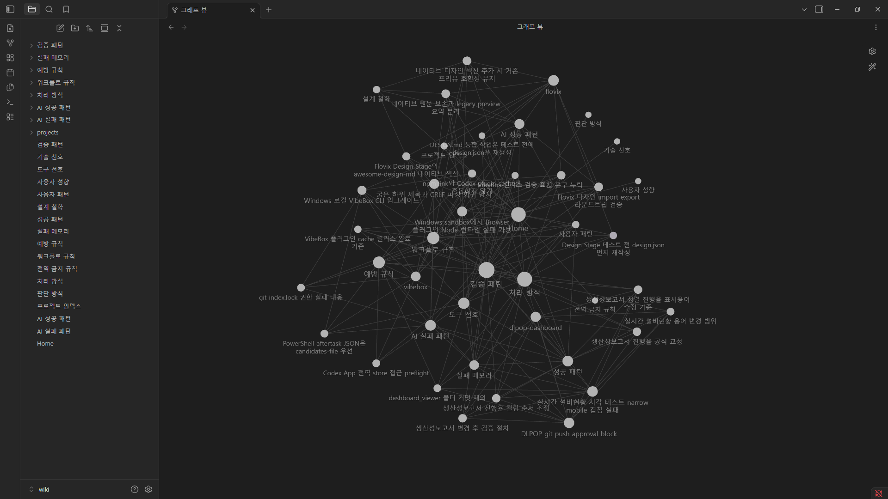

# VibeBox



VibeBox is local-first memory middleware for AI coding agents.

It helps an agent remember durable user preferences, project rules, validation habits, failure-avoidance rules, and reusable successful approaches without turning the project repository into a memory store.

## What It Is

VibeBox sits beside an AI coding workflow:

1. Before work, the agent runs `vibebox pretask` or `vibebox context`.
2. The agent reads active guidance and applies it while inspecting the repository.
3. After meaningful work, the agent runs `vibebox aftertask`.
4. The agent supplies the original `userRequest` plus structured memory candidates.
5. VibeBox Core validates, stores, dedupes, indexes, links, and renders those candidates.



The semantic contract is simple: the AI agent interprets the user's request and creates structured candidates. VibeBox Core does not decide meaning from raw text, summaries, keywords, headings, or command output.

## Why It Helps

AI coding agents often repeat the same mistakes across sessions: changing files the user wanted preserved, skipping validation, forgetting preferred workflows, or reusing an approach the user rejected.

VibeBox turns those reusable lessons into active guidance:

- `User Success Criteria`: what a good result means for the user.
- `AI Failure Avoidance`: mistakes, tool failures, and rejected directions to avoid.
- `AI Successful Approaches`: reusable methods that worked before.

Past memory is context, not authority. The current user request always wins.

## Quick Start

Requirements:

- Node.js 20 or newer
- npm

Install from a checkout:

```bash
git clone https://github.com/boksajang/vibebox.git
cd vibebox
npm install
npm link
vibebox init
vibebox doctor
```

Use it around meaningful repository work:

```bash
vibebox pretask --task "Fix dashboard table scrolling"
vibebox schema --format json
vibebox aftertask --request "Fix dashboard table scrolling" --summary "Used wrapper-level scrolling and ran tests." --candidates-file structured-candidates.json --technical-outcome success --user-acceptance unknown
```

On Windows or Codex App, prefer the command shim:

```bash
vibebox.cmd pretask --task "Fix dashboard table scrolling"
vibebox.cmd schema --format json
vibebox.cmd aftertask --request "Fix dashboard table scrolling" --summary "Updated table scrolling." --candidates-file structured-candidates.json
```

`schema` prints the current structured candidate enum values and skeleton from VibeBox Core. `aftertask` needs structured candidates when active memory should be created. An action summary alone is raw evidence only.

## Codex Plugin Use

VibeBox includes a Codex plugin wrapper at `.codex-plugin/plugin.json` and a shared skill at `skills/vibebox/SKILL.md`.

Install or register the marketplace source:

```bash
codex plugin marketplace add boksajang/vibebox
```

Then enable the `vibebox` plugin in Codex and start a new session.

Codex App can read an installed plugin cache instead of your local checkout. A GitHub push alone does not update that installed cache. After updating local plugin source, run `git pull` or reinstall the plugin, then verify the cache folder and key file hashes.

Example cache placeholder:

```text
%USERPROFILE%\.codex\plugins\cache\personal\vibebox\0.1.1\
```

VibeBox does not delete or rewrite Codex App plugin cache files automatically.

## Obsidian Wiki



The Obsidian-compatible wiki is a display layer for user review, not the source of truth. The global store remains the source of truth, and JSON indexes drive retrieval.

Default wiki locations:

```text
<USER_HOME>/.vibebox/wiki
%USERPROFILE%\.vibebox\wiki
```

Wiki filenames, titles, summaries, aliases, and link labels follow the configured `memoryLanguage`. `memoryLanguage` must be a valid canonical BCP 47 language tag. For non-default initial languages and language conversion targets, the AI Agent must provide a localized display template for the exact configured tag; Core stores and renders that agent-provided template instead of using hardcoded locale packs.

## Runtime Store

VibeBox uses one global store as the single source of truth:

```text
<USER_HOME>/.vibebox
```

Override it with `VIBEBOX_HOME` or `--store <path>` when needed.

VibeBox does not create project-local `.vibebox` folders, workspace-local snapshots, copied stores, pointer files, or hidden metadata in work repositories.

In sandboxed agents, `pretask` and `context` are read-only retrieval commands but still need read access to the global store. `aftertask`, `init`, and `capture` need write access when they register projects, capture events, update active memory, or render wiki files.

## Update Workflow

For local source:

```bash
git pull
npm install
npm link
vibebox doctor
```

For Codex App plugin use:

1. Update or reinstall the plugin source.
2. Start a new Codex session.
3. Verify the installed cache under `%USERPROFILE%\.codex\plugins\cache\personal\vibebox\`.
4. Compare `.codex-plugin/plugin.json`, `skills/vibebox/SKILL.md`, skill references, and adapter docs between the source and installed cache.

## Documentation

- [Concept](docs/CONCEPT.md)
- [Usage](docs/USAGE.md)
- [Memory Model](docs/MEMORY_MODEL.md)
- [Obsidian Wiki](docs/OBSIDIAN.md)
- [VibeBox Skill](skills/vibebox/SKILL.md)
- [Command Reference](skills/vibebox/references/COMMANDS.md)
- [Workflow Reference](skills/vibebox/references/WORKFLOW.md)
- [Memory Policy](skills/vibebox/references/MEMORY_POLICY.md)
- [Common Adapter](adapters/common/README.md)
- [Codex Adapter](adapters/codex/README.md)
- [Claude Adapter](adapters/claude/README.md)

## Privacy

VibeBox is local-first. It does not sync memory to a cloud service by itself. Sensitive values should not be stored as active memory, wiki text, or Context Pack content.

## License

MIT License. Created by Boksajang.
